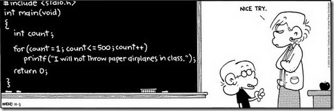

# Web server
`DevOps`
`SysAdmin`

A good Software Engineer is a [lazy-Software-Engineer.](https://www.techwell.com/techwell-insights/2013/12/why-best-programmers-are-lazy-and-act-dumb)

## Learning Objectives
At the end of this project, you are expected to be able to explain to anyone, without the help of Google:

### General
+ What is the main role of a web server
+ What is a child process
+ Why web servers usually have a parent process and child processes
+ What are the main HTTP requests

### DNS
+ What DNS stands for
+ What is DNS main role

### DNS Record Types
+ A
+ CNAME
+ TXT
+ MX
